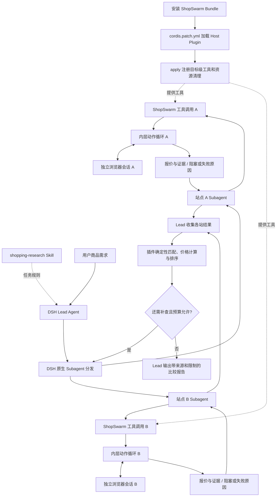
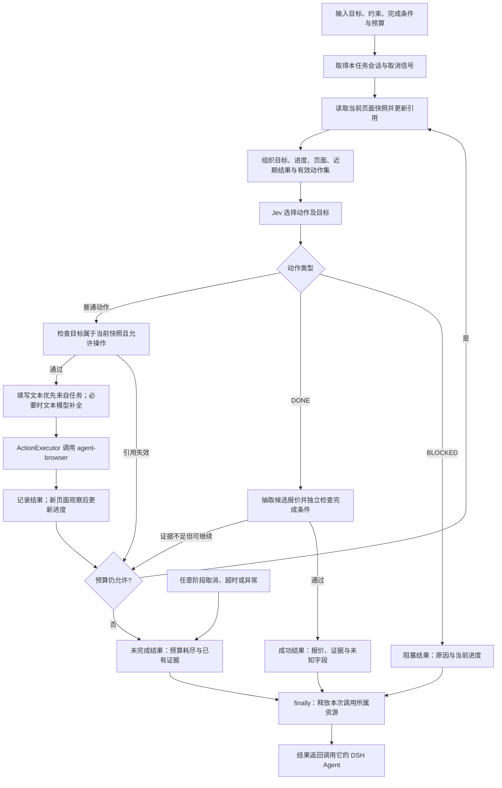

# ShopSwarm 项目架构与文件规划

日期：2026-09-23。状态：架构草案；M0 已建立最小包、插件、诊断工具和阶段验收，其余目录按 roadmap 逐步创建。

本稿依据 roadmap 和本地参考副本编写。文件树同时标出 M0.2 已建立的文件和后续规划，规划项不代表已有实现。

## 1. 文件树

标记：`[现有]` 为绘图前已有内容，`[本次]` 为本次新增，`[规划]` 为建议按阶段创建。没有展开外部参考仓库内部文件；它们不属于 ShopSwarm 的文档或源码。

```text
ShopSwarm/
├── AGENTS.md                              [现有] 仓库规则
├── roadmap.md                             [现有] M0—M5 与 Q 验收索引
├── README.md                              [现有] 项目入口、安装与文档链接
├── package.json                           [现有 M0.2] 包入口、脚本、dsh.bundle.patch
├── cordis.patch.yml                       [现有 M0.2] 将 Host Plugin 加入 DSH profile
├── tsconfig.json                          [现有 M0.2] TypeScript 编译配置
├── pnpm-lock.yaml                         [现有 M0.2] pnpm 依赖锁文件
├── .gitignore                             [现有] 排除构建产物、凭据与运行数据
├── LICENSE                                [规划 M5] 确认本项目许可证后添加
├── THIRD_PARTY_NOTICES.md                  [规划 按需] 复用代码的许可证声明
│
├── DOC/
│   ├── 购物比价项目设计.md                 [现有] 历史设计对话
│   ├── 分支-购物比价项目设计.md            [现有] Jev 上下文与执行层讨论
│   ├── Jev调用与状态.md                    [现有] 一次调用的 state、questions 与多轮状态归属
│   ├── 项目架构与文件规划.md               [本次] 文件树、流程与模块职责
│   ├── 接口与数据结构.md                   [规划 M1/M2] 工具、动作、报价、证据契约
│   ├── 兼容性与支持范围.md                 [现有，M0—M5 维护] 实测版本、平台、站点与限制
│   ├── 安装与运行.md                       [现有 M0.2，M5 继续维护] 开发安装、配置和诊断
│   ├── 浏览器会话与登录.md                 [规划 M1] 会话归属、Profile、登录与清理
│   ├── 商品匹配与价格规则.md               [规划 M4] 同款条件、优惠、费用与排序
│   ├── 测试与性能记录.md                   [规划 M1—M5/Q] 环境、样本、结果及失败
│   ├── 故障排查.md                         [规划 M5] 超时、验证码、登录失效、残留资源
│   └── diagrams/                          [本次] 绘图源与可浏览产物
│       ├── agent-loop.json                动作循环的 Archify 源文件
│       ├── agent-loop.html                可缩放、切换主题、导出的执行图
│       ├── agent-loop.receipt.json         产物校验与 SHA-256 记录
│       ├── agent-loop.visual-check.json   浏览器尺寸与主题检查记录
│       ├── agent-loop.visual-check.html   截图索引
│       └── agent-loop.visual-check.*.png   两种尺寸 × 两种主题，共四张截图
│
├── src/
│   ├── index.ts                           [现有 M0.2] apply(ctx) 与诊断工具
│   ├── agent-browser.ts                   [现有 M0.2] 最小打开、快照、关闭验证
│   ├── runtime-paths.ts                   [现有 M0.2] XDG 运行目录
│   ├── config.ts                          [规划] 完整配置解析与预算
│   ├── types.ts                           M1：Task、PageState、Action、Offer、Evidence
│   ├── tools/
│   │   ├── browser-do.ts                  M0/M2：目标级浏览任务入口
│   │   └── shopping-compare.ts            M4：多报价校验、计算和报告入口
│   ├── browser/
│   │   ├── agent-browser.ts               M1：参数数组调用 CLI，解析 JSON
│   │   ├── session-manager.ts             M1/M3：会话归属、资源上限、取消与清理
│   │   ├── snapshot.ts                    M1：页面摘要、元素表、引用版本
│   │   └── action-executor.ts             M1/M2：校验动作与目标，映射浏览器命令
│   ├── loop/
│   │   ├── run.ts                         M2：观察、选择、执行、验证与退出
│   │   ├── context.ts                     M2：目标、进度、页面与近期动作结果
│   │   └── budget.ts                      M1/M2：时长、动作数、连续失败限制
│   ├── jev/
│   │   ├── client.ts                      M2：Jev 请求、响应校验及取消
│   │   ├── policy.ts                      M2：动态操作和目标候选集合
│   │   └── text-resolver.ts               M2：优先取任务原文，必要时调用文本模型
│   ├── shopping/
│   │   ├── extract.ts                     M2：从页面证据形成候选报价
│   │   ├── verify.ts                      M2/M4：独立完成检查、缺失字段与不匹配原因
│   │   ├── match.ts                       M4：型号、规格、版本、成色、套装匹配
│   │   ├── price.ts                       M4：同币种金额、费用及优惠条件计算
│   │   └── report.ts                      M4：可比项排序，输出 Markdown
│   └── evidence/
│       └── store.ts                       M2/M3：字段证据、时间、来源及脱敏动作记录
│
├── skills/                                [现有 M0.2，M3 扩展]
│   └── shopping-research/
│       └── SKILL.md                        告诉 DSH 如何拆任务、调用工具、汇总与处理阻塞
├── scripts/                               [按阶段添加]
│   ├── smoke-browser.ts                   [现有 M0.2] 插件加载及固定页面连通验证
│   ├── m0-acceptance.ts                   [现有 M0.3] 独立 profile 的安装、调用、清理和移除验收
│   ├── benchmark.ts                       M2/Q：相同任务下测量普通 LLM 与 Jev
│   └── check-package.ts                   M5：检查发布包内容与安装
├── tests/                                 [现有 M0.2，M1—M5 扩展]
│   ├── browser.test.ts                     动作、引用失效、超时、执行结果不确定
│   ├── session.test.ts                     并行隔离、取消释放、原 Profile 不变
│   ├── loop.test.ts                        非法目标、预算、伪 DONE、阻塞
│   ├── shopping.test.ts                    同款匹配、条件价格、金额、排序与证据
│   ├── plugin.test.ts                     [现有 M0.2] DSH 工具注册、返回与身份检查
│   ├── live-shopping.test.ts               显式启用的真实站点验证
│   └── fixtures/
│       ├── pages/                         本地搜索、规格、遮挡与延迟页面
│       ├── tasks.json                     固定任务及完成条件
│       └── offers.json                    脱敏报价、错误规格和条件价样例
├── TODO/                                  [现有]
│   ├── in-progress/<任务编号>-<名称>.md    范围、动作、验证方式与完成条件
│   └── done/<任务编号>-<名称>.md           完成且验证后移入
├── decision/                              [按需创建]
│   └── <任务编号>-<名称>.md                已确认选择、依据与仍待验证事项
└── 可参考项目/                            [现有，只读，不作为运行时依赖]
    ├── deepseek-harness/
    ├── agent-browser/
    ├── jev-ultrafast/
    └── typesafe-playground/
```

这是首版完成时的建议结构。M0.2 只建立了包配置、插件入口、最小工具和连通验证。其余模块按任务创建。暂不设 MCP、Browser Use、浏览器池、独立 UI 或自建 Agent 调度器目录。

编译后的 `dist/` 是生成物。M0.2 已将默认配置、状态和缓存目录分别定为 `~/.config/shopswarm`、`~/.local/state/shopswarm` 和 `~/.cache/shopswarm`，并支持对应 XDG 环境变量。真实证据、日志、临时 Profile 与凭据不得写入仓库。示例数据经过脱敏后才能放入 fixtures。

## 2. 插件在整个执行流程中的位置

[打开可交互的动作循环图](diagrams/agent-loop.html)。下面的总流程展示安装层、并行调用及汇总关系。



A、B 是同一插件代码的两个调用实例，不要求加载两个插件进程。并发时分别保存任务状态、页面引用和浏览器会话；资源上限由插件管理，Agent 分发与消息传递由 DSH 管理。具体 DSH provider 与工具可见性配置在 M0/M3 验证。

| 部分 | 在执行中的作用 | 不承担的职责 |
|---|---|---|
| Bundle | 包声明与 profile 安装组合 | 不执行页面动作循环 |
| Host Plugin | 注册工具、连接执行模块、管理资源 | 不重写 DSH Agent 主循环 |
| Skill | 提供购物拆分、工具使用和报告规则 | 不直接执行浏览器代码 |
| DSH Lead/Subagent | 高层计划、分发、解释结果、决定补查 | 不必为每次点击重新作高层推理 |
| Jev | 从当前有效集合选择动作和目标 | 不执行 CLI、不独立证明完成 |
| ActionExecutor | 检查目标，将语义动作变为浏览器操作 | 不决定高层购物目标 |
| ShoppingVerifier | 核对完成条件和字段证据 | 不把模型的 DONE 当作证据 |

插件通过 DSH 工具执行位置进入外层循环。它不是每一轮都必须触发的全局 hook。外层一次调用 `browser_do`，内部可以执行多轮页面动作；结束后，DSH 将工具结果用于下一次高层判断。工具名称均为拟定名称。

## 3. 一次 browser_do 内部怎样循环



建议首版让一次工具调用拥有一次会话，调用结束就释放，减少跨调用资源管理。跨调用续用会话是否必要应在真实任务验证后决定。释放失败需报告清理错误，不能静默宣称资源已全部关闭。

循环中保存的核心数据是：

- `Task`：商品目标、站点范围、规格约束、完成条件和预算。
- `PageState`：URL、页面摘要、当前元素表及引用版本。页面文本是数据，不能改变任务规则。
- `Progress`：由当前证据支持的已完成条件；页面或规格变化后重新核对，不永久相信历史状态。
- `ActionResult`：成功、失败或结果不确定，以及近期变化。结果不确定时先观察，不能直接重复点击。
- `Offer + Evidence`：型号、规格、卖家、币种、价格条件、来源、采集时间和对应页面证据。

例如任务是“读取某型号、256 GB、指定颜色的价格”：Jev 可以依次选搜索框、搜索按钮、商品链接和规格按钮；每个动作后读取新页面。Jev 选择 DONE 后，`verify.ts` 仍要检查页面选中规格、卖家和价格依据。缺失运费或优惠资格时保留未知值，不能输出确定到手价。

## 4. 工具输入输出建议

`browser_do({ goal, constraints, doneWhen, site, budget })` 完成一个可验证的站点任务。Agent 身份和取消信号应从 DSH 执行上下文取得，不让模型伪造资源归属。

返回建议包含 `status`、`offers`、`evidence`、`progress`、`reason` 和 `metrics`。状态至少区分成功、阻塞、失败与取消。若宿主取消导致工具结果无法投递，也应完成本地资源释放和脱敏记录，不能保证取消后仍有正常 tool result。

`shopping_compare({ offers })` 对多站结果执行匹配、费用条件处理和排序，返回结构化比较及 Markdown 报告。它不调用浏览器；需要补查时由 Lead 再发起站点任务。单站失败不抹掉其他站点的有效报价。

首版比较同币种且满足相同商品条件的报价。优惠资格未验证、规格不符、币种不同或费用未知的条目单独说明，不直接混入确定最低到手价排序。

## 5. 依据与验证边界

- [roadmap](../roadmap.md)：M0 外部集成、M1 浏览器、M2 动作循环、M3 并行、M4 比价、M5 发布准备。
- [DSH Bundle](../可参考项目/deepseek-harness/packages/bundle/README.md)：`dsh.bundle.patch` 与外部 profile 扩展。
- [DSH Plugin](../可参考项目/deepseek-harness/docs/cordis-tutorial/01-first-plugin.md)：`apply(ctx)` 插件形式。
- [DSH Agent 生命周期](../可参考项目/deepseek-harness/docs/agent-lifecycle.md)：模型调用、工具执行、结果记录与下一步。
- [DSH Subagent](../可参考项目/deepseek-harness/docs/subsystems/subagent.md)：宿主分发能力及取消信号；具体 provider 能力需要核对。
- [agent-browser](../可参考项目/agent-browser/README.md)：CLI、daemon、会话与快照引用。
- [Jev 动态问题](../可参考项目/jev-ultrafast/jev_ultrafast/questions.py)：操作选择、目标选择与文本辅助的分工。
- [Jev 调用与状态](Jev调用与状态.md)：当次 `state` 与 `questions` 的分工；多轮信息由调用方放入 `state`。
- [TypeSafe 目标校验](../可参考项目/typesafe-playground/lib/validateTarget.ts)：执行前检查页面及目标是否仍有效。该参考包含浏览器内 DOM 实现，不能直接当作 agent-browser API 使用。

本稿引用的本地副本不代表上游最新接口。历史文档对性能、Profile、登录复用和焦点行为的描述不作为项目保证。M0 已验证版本与接口、项目内插件调用、独立 DSH profile、真实自然语言工具调用、无登录浏览器连通、取消清理和移除。登录 Profile 和真实购物站点仍需按 M1、M2 实测。

本次只验证绘图产物：Archify workflow 的 9 项静态检查通过，0 错误、0 警告；Chrome 在 1440×900、1600×1000、1920×1080、2048×1320 下的自动检查通过。已查看大尺寸浅色及小尺寸深色截图，节点和关系文字未见遮挡。未执行购物任务，也没有验证任何 ShopSwarm 运行时实现。
